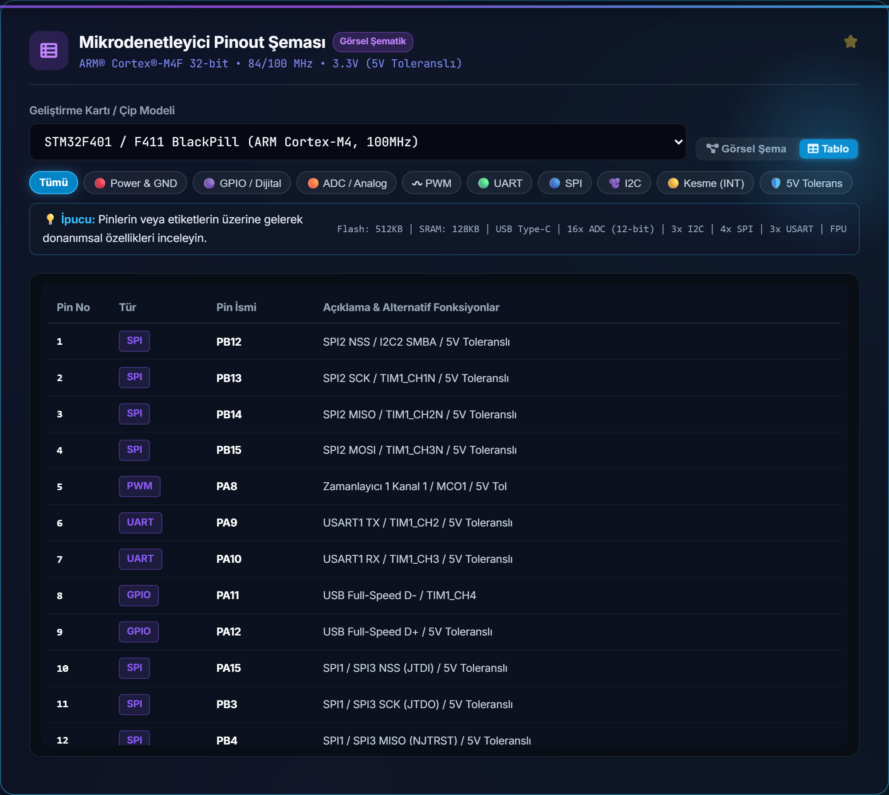
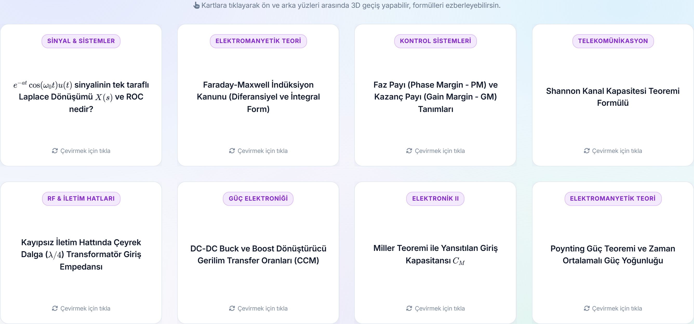
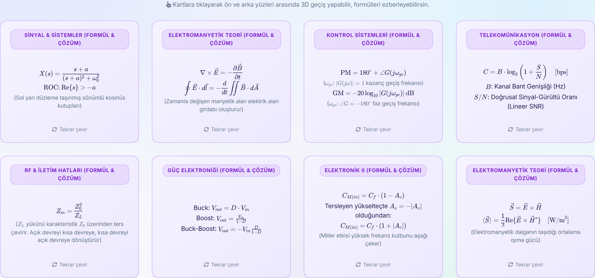

# 📚 Devrem Studio - Görsel Öğretici & Modül Kullanım Rehberi

> Bu rehber, **Devrem Studio (EEM Rehber)** platformunda yer alan tüm sanal laboratuvar araçlarının, mikrodenetleyici pinout sisteminin ve interaktif simülatörlerin nasıl kullanılacağını ekran görüntüleriyle adım adım açıklamaktadır.

---

## 📌 İçindekiler
1. [Ana Arayüz & Genel Bakış](#1-ana-arayüz--genel-bakış)
2. [Analog Filtre Tasarımı & Bode Eğrisi](#2-analog-filtre-tasarımı--bode-eğrisi)
3. [2. Derece Kontrol Sistemleri & Basamak Yanıtı](#3-2-derece-kontrol-sistemleri--basamak-yanıtı)
4. [Fazör Analizörü & Dinamik Vektör İzdüşümü](#4-fazör-analizörü--dinamik-vektör-izdüşümü)
5. [3-Fazlı Güç & Dengesiz Yük Simülatörü](#5-3-fazlı-güç--dengesiz-yük-simülatörü)
6. [Op-Amp 7 Devre Topolojisi & Kırpılma Osiloskobu](#6-op-amp-7-devre-topolojisi--kırpılma-osiloskobu)
7. [Web Audio Gerçek Zamanlı Sinyal Jeneratörü](#7-web-audio-gerçek-zamanlı-sinyal-jeneratörü)
8. [Smith Chart RF Empedans Eşleme](#8-smith-chart-rf-empedans-eşleme)
9. [İnteraktif Mikrodenetleyici (MCU) Pinout Rehberi](#9-interaktif-mikrodenetleyici-mcu-pinout-rehberi)
10. [KaTeX Matematiksel Formül Flashcard'ları](#10-katex-matematiksel-formül-flashcardları)

---

## 1. Ana Arayüz & Genel Bakış

Platform açıldığında sizi karşılayan ana çalışma istasyonu; modern **2026 Obsidian Gece Teması** ve **Pastel Gündüz Teması** seçenekleri, `Ctrl + K` hızlı arama çubuğu ve procedurally-generated (algoritmik çizilen) interaktif PCB arka planı ile donatılmıştır.

* **Spotlight Arama (`Ctrl + K`):** Saniyeler içinde 15+ laboratuvar aracına, sınav sorularına veya formüllere doğrudan odaklanmanızı sağlar.
* **Akıllı Sınıf Filtresi:** 1-2. Sınıf (Temel Devreler), 3. Sınıf (Sinyal/Kontrol), 4. Sınıf (Bitirme/Uzmanlaşma) veya Kariyer moduna göre arayüzü filtreler.

---

## 2. Analog Filtre Tasarımı & Bode Eğrisi

Analog aktif ve pasif filtre devrelerinin frekans cevabını canlı olarak analiz eder.

| Koyu Tema Görünümü | Açık Tema Görünümü |
| :---: | :---: |
|  |  |

### Nasıl Kullanılır?
1. Filtre tipini seçin: **Alçak Geçiren (LPF)**, **Yüksek Geçiren (HPF)**, **Bant Geçiren (BPF)** veya **Bant Durduran (Notch)**.
2. Direnç ($R$) ve Kondansatör ($C$) değerlerini girin.
3. Kanvas üzerinde farenizi gezdirdiğinizde:
   * Kesim frekansı ($f_c = \frac{1}{2\pi RC}$) anlık olarak işaretlenir.
   * İmlecin bulunduğu frekanstaki kazanç ($dB$) ve faz açısı ($\theta$) anlık yeşil HUD bilgi balonunda gösterilir.

---

## 3. 2. Derece Kontrol Sistemleri & Basamak Yanıtı

Kontrol mühendisliğinin temelini oluşturan 2. derece transfer fonksiyonlarının basamak tepkisini ($y(t)$) yüksek hassasiyetle simüle eder.

| Koyu Tema Görünümü | Açık Tema Görünümü |
| :---: | :---: |
|  |  |

### Analiz Edilen Kritik Parametreler:
* **Sönüm Oranı ($\zeta$):**
  * $\zeta = 0$: Sönümsüz osilasyon
  * $0 < \zeta < 1$: Eksik sönümlü (aşım yapan dinamik yanıt)
  * $\zeta = 1$: Kritik sönümlü
  * $\zeta > 1$: Aşırı sönümlü
* **Doğal Frekans ($\omega_n$):** Sistemin tepki verme hızını belirler.
* **Grafik Üzerinde Canlı Okuma:** Tepe aşımı ($M_p$), oturma zamanı ($T_s \pm \%2$) ve yükselme zamanı ($T_r$) fare hareketine duyarlı olarak gösterilir.

---

## 4. Fazör Analizörü & Dinamik Vektör İzdüşümü

Alternatif akım (AC) devrelerinde karmaşık sayıları fazör oklarına dönüştürür.

| Koyu Tema Görünümü | Açık Tema Görünümü |
| :---: | :---: |
|  |  |

### Özellikler:
* **Kutupsal & Kartezyen Giriş:** $V = V_{max} \angle \theta^\circ$ veya $V = a + jb$ formatında anında çift yönlü dönüşüm.
* **Canlı İzdüşüm:** Gerçek (Reel) ve Sanal (İmajiner) eksenlerdeki bileşenler, açı yayları ve genlik vektörü HiDPI kanvasta çizilir.

---

## 5. 3-Fazlı Güç & Dengesiz Yük Simülatörü

Endüstriyel güç sistemlerinde dengeli ve dengesiz 3 fazlı yükleri modeller.

| Koyu Tema Görünümü | Açık Tema Görünümü |
| :---: | :---: |
|  |  |

* **Bağlantı Modları:** Yıldız ($Y$) ve Üçgen ($\Delta$) yük konfigürasyonları.
* **Nötr Akımı Analizi:** Dengesiz yüklerde nötr hattından ($I_N$) geçen artık akımın büyüklüğü ve faz açısı canlı hesaplanır.
* **Falstad Simülasyonu:** Tek tıkla ilgili devreyi tarayıcı içi Falstad simülatöründe çalıştırma bağlantısı.

---

## 6. Op-Amp 7 Devre Topolojisi & Kırpılma Osiloskobu

Operasyonel yükselteçlerde (LM741, TL072 vb.) giriş sinyali ile çıkış sinyalini karşılaştırmalı olarak osiloskopta gösterir.

| Koyu Tema Görünümü | Açık Tema Görünümü |
| :---: | :---: |
|  |  |

* **Desteklenen 7 Topoloji:** Eviren (Inverting), Evirmeyen (Non-Inverting), Gerilim İzleyici (Buffer), Toplayıcı (Summing), Fark Alıcı (Difference), Türev Alıcı (Differentiator), İntegral Alıcı (Integrator).
* **Ray-Ray Doyum (Clipping):** Giriş sinyali besleme gerilimlerini ($\pm V_{cc}$) aştığında çıkışın nasıl düzleşip kırpıldığını gerçek zamanlı gösterir.

---

## 7. Web Audio Gerçek Zamanlı Sinyal Jeneratörü

Cihazınızın ses işlemcisini kullanarak laboratuvar tipi fonksiyon üreteci görevi görür.

| Koyu Tema Görünümü | Açık Tema Görünümü |
| :---: | :---: |
|  |  |

* **Frekans Aralığı:** 20 Hz ile 20.000 Hz arası hassas kaydırıcı kontrolü.
* **Dalga Formları:** Sinüs, Kare, Üçgen, Testere Dişi.
* **Osiloskop Ekranı:** Üretilen ses sinyalinin zamana bağlı dalga formu doğrudan kanvas üzerinde çizilir.

---

## 8. Smith Chart RF Empedans Eşleme

RF, mikrodalga ve yüksek frekans iletim hatlarında empedans eşleme analizörü.

| Koyu Tema Görünümü | Açık Tema Görünümü |
| :---: | :---: |
|  |  |

* Sabit direnç ($r$) ve sabit reaktans ($x$) çemberleri üzerinde normalize yük empedansını ($z_L = r + jx$) konumlandırır.
* Yansıma katsayısı genliği ($|\Gamma|$), açısı ve Gerilim Duran Dalga Oranı (VSWR) anında hesaplanır.

---

## 9. İnteraktif Mikrodenetleyici (MCU) Pinout Rehberi

Gömülü sistem geliştiricileri için SVG tabanlı, tam etkileşimli pin şeması.

| Arduino Uno (Koyu) | Arduino Uno (Açık) |
| :---: | :---: |
|  |  |

### Çevresel Birim Filtreleme (PWM, I2C, SPI, UART, ADC)
Pencerelerdeki filtre butonlarına basıldığında (örneğin **PWM** seçildiğinde), ilgisiz tüm pinler soluklaşır ve yalnızca PWM destekleyen donanımsal pinler parlar:

### Desteklenen Popüler Kartlar:
| ESP32 DevKit v1 | STM32 BlackPill (F401) | Raspberry Pi Pico (RP2040) |
| :---: | :---: | :---: |
|  |  |  |

### Grafik ve Tablo Görünümü Geçişi
Geliştiriciler dilerse tek bir butonla görsel kart şemasından tüm pin alternatiflerinin listelendiği yüksek kontrastlı tablo moduna geçebilir:

---

## 10. KaTeX Matematiksel Formül Flashcard'ları

Sınavlara hazırlanan mühendislik öğrencileri için formül ezberleme ve soru-cevap kartları.

| Soru / Ön Yüz (Koyu) | Detaylı Çözüm / Arka Yüz (Koyu) |
| :---: | :---: |
|  |  |

| Soru / Ön Yüz (Açık) | Detaylı Çözüm / Arka Yüz (Açık) |
| :---: | :---: |
|  |  |

* **KaTeX LaTeX Render:** Laplace dönüşümleri, Maxwell denklemleri, Miller teoremi, Shannon kapasitesi ve rezonans formülleri kitap netliğinde matematiksel dizgiyle ekrana gelir.
* **Flip (Çevir) Animasyonu:** Karta tıklandığında yumuşak bir 3D dönüş efektiyle sorunun cevabı ve mühendislik yorumu açılır.

---

*Devrem Studio - Elektrik-Elektronik Mühendisliği Profesyonel Çalışma İstasyonu*
